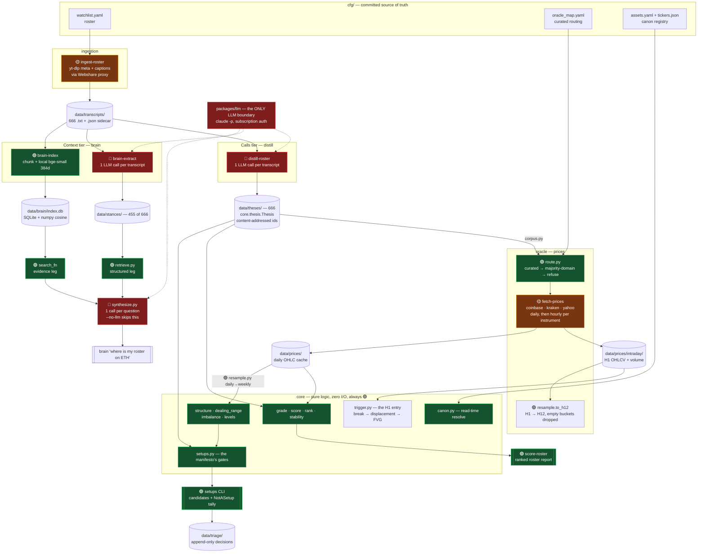

# Architecture — data flow and cost map

Six uv packages, one shared `core` contract, and a filesystem-as-database: everything under
`data/` is regenerable ore, and no stage mutates what an upstream stage wrote — **with two
exceptions that are records rather than caches**: `data/setups/decisions.jsonl` (and its
triage sibling) hold hand-entered judgement that nothing can recompute, and `data/funding/`
holds observations of a window the venues stop serving — see `oracle.funding_store`. Deleting
either loses information permanently. Everything else can be rebuilt by re-running its stage.

Spine: **ingest → distill → price → cross-reference**, with a parallel **stance/context**
branch feeding the `brain` Q&A head.

## Cost legend

| | Meaning |
| --- | --- |
| 🔴 **METERED** | Calls an LLM. Burns Max-subscription usage via `claude -p`. Re-running the full corpus is hours + a large chunk of the rotating allowance. |
| 🟡 **NETWORK** | Hits a third-party API. Free tier / already-paid proxy, but rate-limitable and slow. |
| 🟢 **FREE** | Pure local compute or disk. Re-run as often as you like. |

There are **exactly three LLM call sites in the entire repo**:

- `packages/distill/src/distill/extract.py:47`
- `packages/brain/src/brain/extract.py:72`
- `packages/brain/src/brain/synthesize.py:159`

All three route through `packages/llm/src/llm/claude_code.py`, which strips
`ANTHROPIC_API_KEY` from the subprocess env on every call so it can never silently fall
back to metered pay-per-token API billing. If a module doesn't import `llm`, it cannot
cost you anything.

## Diagram



## Timeframes — which bars answer which question

Weekly sets the bias, the rung below it holds the zones, and H1 is where the entry is confirmed.
Which rung an instrument gets is **measured, not assigned by asset class**: `resample.straddles_the_split`
asks whether the thinner half of the UTC day carries at least 25% of the activity.

| Rung | Job | Crypto · FX · futures · `^VIX` | Equities · session-bound indices |
|---|---|---|---|
| bias | direction | weekly | weekly |
| setup | where the zone is | **H12** (resampled from H1) | **daily** (already cached) |
| trigger | when to enter | H1 | H1 |

`^GSPC` is an index that behaves like an equity and `^VIX` is one that does not, which is why no
class label works — the asset-class table this replaced was wrong three times. Details and the
measurements: `oracle/resample.py`, `core/trigger.py`, `scripts/probe_intraday_gaps.py`.

## Command cost table

This is a **uv workspace**: one `.venv` and one `uv.lock` at the repo root cover all eight
packages. Every command below is run as `uv run <command>` **from the repo root** — never
`cd` into `packages/*/`, which would build a second, divergent environment.

| Command (prefix with `uv run`) | Cost | Notes |
| --- | --- | --- |
| `distill-roster` | 🟢 | No-op — all 666 already distilled; skips existing thesis files. |
| `distill-roster --force` | 🔴🔴 **DANGER** | Re-distills all 666 from scratch. Use `--concurrency 3`, never the default 6. |
| `distill-transcript <id>` | 🔴 | One transcript, one call. Cheap. |
| `brain-extract` | 🔴 | Resumable — skips the 455 already done, so ~211 remain. |
| `brain-extract --force` | 🔴🔴 **DANGER** | Re-extracts all 666. |
| `brain "<question>"` | 🔴 | One synthesis call per question. Trivial cost. |
| `brain "<question>" --no-llm` | 🟢 | Structured + evidence legs only. Completely free. |
| `brain-index` | 🟢 | Local embedding model (`BAAI/bge-small-en-v1.5`) on CPU. Slow first run (downloads weights), zero dollars. |
| `ingest-roster` / `ingest-channel` | 🟡 | Needs the Webshare proxy for the caption endpoint. Idempotent; skips existing. |
| `ingest-x` | 💸 **REAL MONEY** | The only command billed in actual dollars — see below. Measured ~$0.22–0.25/run with charts on the 11-handle digest. **Off in the nightly by default since 2026-08-18**; still spends when run by hand. |
| `verify-roster` | 🟢 | Probes declared YouTube channels against the watchlist. No key, no proxy. Exits non-zero on disagreement. |
| `scripts/nightly.sh` | 🔴 | The whole cycle. The day's distillation only — `ingest-x` is off by default, so a nightly spends no real money. `--with-x` restores it and makes the run 💸. Totals both and writes one line to `~/vault/Trading/Trade Logs/Nightly.md`. |
| `execute` | 🟡 | Pre-flight only — reports network, equity and market availability. Structurally incapable of placing an order. |
| `book` | 🟡 | What the account is holding: resting entries with ages, open positions, and what is left. Read-only. `--venue` reaches the venue that is not the default. |
| `book --reconcile` | 🟡 | Asks the venue what became of every order the log calls `placed`, then records how filled trades ENDED. Read-only **at the venue**; it does append `reconciled` and `closed` rows to the order log and one line per close to the vault. Runs nightly, once per venue. |
| `book --closed` | 🟢 | The realised history — what each finished trade made, in R net of fees and funding. Reads the log only. |
| `book --cancel` | 🟡 / 🔀 | Cancels **resting entries only**, never positions, and only ones you select and confirm. Reduces exposure, so it takes no typed phrase — but on `live` it is a real order cancellation. |
| `digest` | 🔴 | What changed overnight. One `claude -p` call for the roster section only — ~17s, trivial. Everything else is local file reads, now including a `review` pass over every portfolio in `data/portfolios/` — verdict moves plus positions that reached a weekly level overnight (free; a portfolio that fails to load costs a warning, not the digest). |
| `digest --no-llm` | 🟢 | Every section except the roster narration. Completely free. |
| `review [name]` | 🟢 | What to do about positions you already hold, from `data/portfolios/<name>.yaml`. Reads the price cache and the stance store; no LLM, no network, places nothing. A holding with no cached price prints a row saying so rather than vanishing. Ends with a LEVELS section — what price is standing on and closing in on — which is independent of the roster and capped; `--levels` prints the uncapped scan. |
| `plaid-link <name>` | 🟢 | Connects one brokerage account, once. Opens a browser login and writes a read-only access token to `.env`. Free — Plaid's Trial plan allows 10 live connections, and this uses one of them per account. Requests the `investments` product only, so the token cannot trade. Never overwrites an existing token. |
| `plaid-sync [name ...]` | 🟢 | Rewrites the `positions:` block of every linked portfolio from the broker. Free and unmetered — Plaid bills per connection, not per call, so nightly costs nothing. Refuses to write an empty list, so a broker hiccup cannot erase an account. Hand-kept portfolios are untouched and unmentioned. |
| `setups --execute` | 🟢 / 🔀 **CAPITAL** | Free to run. On testnet it moves mock funds; on mainnet it moves **your money** — a different axis from the LLM/API costs above. See below. |

### 🔀 `setups --execute` risks capital, not dollars-per-call

Every other cost in this table is a metered API bill. This one is not: the command itself is
free, and what it puts at stake is the account balance.

- **Off unless typed.** There is no config switch that enables it — `--execute` is a per-run
  flag, so it cannot be left on from a previous session. The nightly job runs `setups --list`,
  which returns before the triage loop exists and therefore cannot reach execution at all.
- **Testnet by default.** `cfg/execution.yaml` ships `network: testnet`. Mainnet needs both
  `--network mainnet` *and* a typed confirmation phrase.
- **One order per approval, after confirmation.** An approved candidate is priced and sized,
  shown in full, and sent only on an explicit `y`. Anything else declines.
- **Sizing is risk-based**: `risk_pct` of live account equity per trade, measured to the
  engine's own stop, capped at `max_notional_frac` leverage.
- Orders, refusals, settlements and closes all append to `data/execution/orders.jsonl`, which is
  the only record linking a fill back to the candidate that caused it — and on Hyperliquid the
  only record linking it to a venue oid at all, since nothing sends a `cloid`.
- **A closed trade's row is the only evidence any scorer can be calibrated against**, so it
  carries what a P/L figure alone would hide: both R denominators (an entry can fill better than
  planned, which tightens the stop it was sized against), fees and funding (0.36R on an 11-day
  perp short), and a `credible` flag naming why a fill is not evidence — paper, above the
  participation ceiling, or a gapped entry that left the stop a fraction of its planned distance.

### Stopping the nightly job

```bash
touch data/nightly.pause     # stop everything; remove the file to resume
touch data/nightly.no-x      # keep the free work, stop spending real money
XAI_MONTHLY_CAP=5.00 …       # automatic backstop, default $20/month
launchctl bootout gui/$(id -u)/com.tseitz.tegan-trades.nightly   # unschedule entirely
```

Sentinel **files** rather than flags, because the thing you want to stop runs while you are not
at the keyboard, and a file left lying around explains its own silence. `launchctl bootout`
leaves nothing behind — and a job that silently stopped looks exactly like a quiet market.

For the opposite question — it is *not* stopped, so why hasn't it run? — `cat data/nightly.gate`.
The job waits for the laptop to be open and awake rather than for a clock, so "nothing happened"
is usually a deferral with a reason, not a failure. See the README.

**Pausing loses nothing.** `ingest-x` resumes from the last captured day, so a paused week is
picked up when you resume, within its 7-day auto-lookback. Past that it warns rather than
silently skipping.

The cap is a **trailing** check: spend is recorded after a run, so the run that crosses the
line completes and the *next* one is skipped. Overshoot is bounded by one run, ~$0.25.
| `fetch-prices` | 🟡 | Free public APIs. Cached to `data/prices/`. **Two passes**: daily for every routed leg, then hourly for each *tradeable* instrument (~300 extra requests, deduped so a proxied asset warms `DIA` once rather than `^DJI` too). `--no-intraday` skips the second. |
| `score-roster` | 🟢 | Reads ore, writes a report. Never mutates `data/theses/`. |
| `fetch-prices --portfolio <name>` | 🟡 | Same run, plus the tickers you hold. A portfolio holds assets nobody on the roster mentions, so the corpus pass alone never reaches them and `review` prints them unpriced forever. Repeatable; pair with `--only <TICKER>` to warm one without re-walking ~300 corpus jobs. |
| `setups` | 🟢 | Cross-reference over cached prices + theses. Reads the hourly cache to pick each asset's setup rung, then refreshes hourly bars for **candidates only** — a few dozen requests, not ~300. `--no-triggers` skips both. |
| `distill-canon` | 🟢 | Explicitly deterministic, no LLM (says so in its docstring). |
| `distill-triage` | 🟢 | Explicitly deterministic, no LLM. |
| `distill-migrate-ids` | 🟢 | Local rewrite. |
| `fetch-tickers` | 🟡 | CoinGecko snapshot, free tier. |
| `./scripts/check.sh` | 🟢 | The gate: ruff + the suite the pre-commit hook runs. ~14s. The only command that reproduces it — `pytest -m "not integration"` alone also collects `needs_ore`. Every LLM path is injected/mocked. |
| `pytest -q` | 🟡 | Adds 7 live-network `integration` tests; the 2 YouTube ones need the Webshare proxy. |

### 💸 `ingest-x` is a different kind of cost

Every other 🔴 in that table bills against the **Max subscription** — `total_cost_usd` from
`claude -p` is a usage-equivalent figure, not a charge. `ingest-x` calls **xAI**, which is
metered pay-per-token on a card. It is the first and only command in the repo that spends real
money, so it is worth knowing what drives it.

Measured 2026-07-26 across four runs, consistent to within 10%:

    cost ≈ $0.0035 per post retrieved
         + $0.005 per x_search invocation
         + ~$0.07 per chart image actually read

**What follows from that, and what doesn't:**

- **Cost tracks post volume, not cadence.** Nightly and weekly over the same month read the
  same posts and cost within ~$1 of each other (~$10.40 vs ~$9.10 text-only). Do not "save
  money" by running it less often; you only lose freshness.
- **A silent handle is nearly free** — one search, ~$0.01. All four handles that posted nothing
  in a two-day window cost $1.20/month combined. Pruning quiet accounts saves nothing.
- **Two handles are 69% of the bill:** `pierre_crypt0` (39 posts/day, ~$4.09/mo) and
  `trader1sz` (29/day, ~$3.04/mo). The handle list is the only real lever.
- **Charts are billed per image read, not per handle enabled.** Turning image understanding on
  for someone who rarely charts costs nothing on their text posts, which is why it is on
  globally rather than configured per person.

`--no-images` roughly halves the bill and loses the most precise price levels in the system.

## What's safe to touch freely

Everything in `packages/core/` is pure — no I/O, no network, no LLM — so all of
`grade`, `score`, `rank`, `stability`, `structure`, `dealing_range`, `imbalance`,
`levels`, `setups`, and `canon` can be edited and re-run at will. The two expensive
artifacts (`data/theses/`, `data/stances/`) are inputs to that logic, never outputs
of it, so changing a gate or a scoring rule costs nothing to re-validate.

The only irreversible-ish button is a `--force` re-extraction. Both extractors are
resume-safe by default; `--force` is what turns them into a full-corpus pass.
