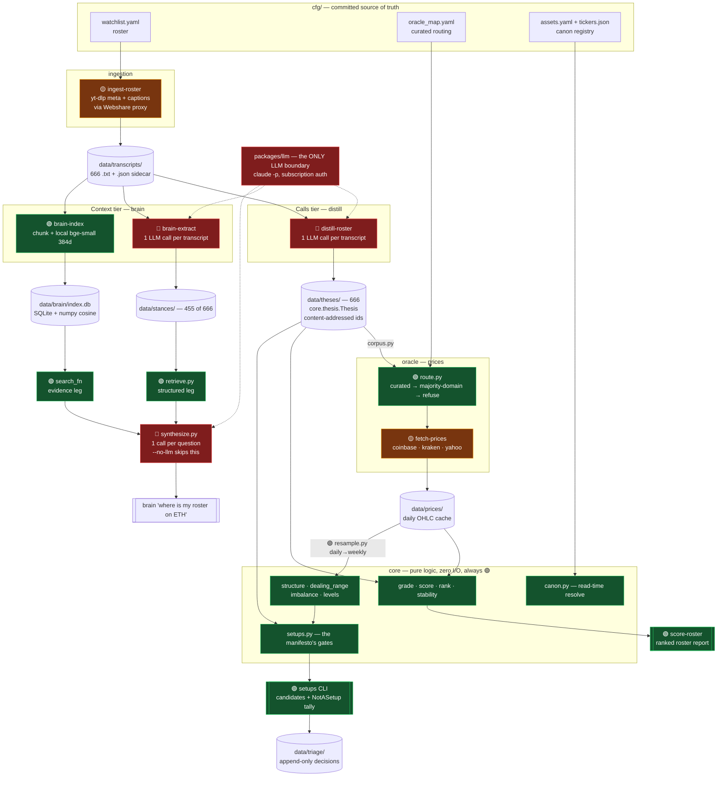

# Architecture — data flow and cost map

Six uv packages, one shared `core` contract, and a filesystem-as-database: everything under
`data/` is regenerable ore, and no stage mutates what an upstream stage wrote.

Spine: **ingest → distill → price → cross-reference**, with a parallel **stance/context**
branch feeding the `brain` Q&A head.

## Cost legend

| | Meaning |
| --- | --- |
| 🔴 **METERED** | Calls an LLM. Burns Max-subscription usage via `claude -p`. Re-running the full corpus is hours + a large chunk of the rotating allowance. |
| 🟡 **NETWORK** | Hits a third-party API. Free tier / already-paid proxy, but rate-limitable and slow. |
| 🟢 **FREE** | Pure local compute or disk. Re-run as often as you like. |

There are **exactly three LLM call sites in the entire repo**:

- `packages/distill/src/distill/extract.py:47`
- `packages/brain/src/brain/extract.py:72`
- `packages/brain/src/brain/synthesize.py:159`

All three route through `packages/llm/src/llm/claude_code.py`, which strips
`ANTHROPIC_API_KEY` from the subprocess env on every call so it can never silently fall
back to metered pay-per-token API billing. If a module doesn't import `llm`, it cannot
cost you anything.

## Diagram

## Command cost table

This is a **uv workspace**: one `.venv` and one `uv.lock` at the repo root cover all six
packages. Every command below is run as `uv run <command>` **from the repo root** — never
`cd` into `packages/*/`, which would build a second, divergent environment.

| Command (prefix with `uv run`) | Cost | Notes |
| --- | --- | --- |
| `distill-roster` | 🟢 | No-op — all 666 already distilled; skips existing thesis files. |
| `distill-roster --force` | 🔴🔴 **DANGER** | Re-distills all 666 from scratch. Use `--concurrency 3`, never the default 6. |
| `distill-transcript <id>` | 🔴 | One transcript, one call. Cheap. |
| `brain-extract` | 🔴 | Resumable — skips the 455 already done, so ~211 remain. |
| `brain-extract --force` | 🔴🔴 **DANGER** | Re-extracts all 666. |
| `brain "<question>"` | 🔴 | One synthesis call per question. Trivial cost. |
| `brain "<question>" --no-llm` | 🟢 | Structured + evidence legs only. Completely free. |
| `brain-index` | 🟢 | Local embedding model (`BAAI/bge-small-en-v1.5`) on CPU. Slow first run (downloads weights), zero dollars. |
| `ingest-roster` / `ingest-channel` | 🟡 | Needs the Webshare proxy for the caption endpoint. Idempotent; skips existing. |
| `ingest-x` | 💸 **REAL MONEY** | The only command billed in actual dollars — see below. ~$0.30–0.85/run with charts, ~$25/mo daily. |
| `fetch-prices` | 🟡 | Free public APIs. Cached to `data/prices/`. |
| `score-roster` | 🟢 | Reads ore, writes a report. Never mutates `data/theses/`. |
| `setups` | 🟢 | Pure cross-reference over cached prices + theses. |
| `distill-canon` | 🟢 | Explicitly deterministic, no LLM (says so in its docstring). |
| `distill-triage` | 🟢 | Explicitly deterministic, no LLM. |
| `distill-migrate-ids` | 🟢 | Local rewrite. |
| `fetch-tickers` | 🟡 | CoinGecko snapshot, free tier. |
| `pytest -q -m "not integration"` | 🟢 | 694 tests, whole workspace, ~1.4s. Every LLM path is injected/mocked. |
| `pytest -q` | 🟡 | Adds 7 live-network `integration` tests; the 2 YouTube ones need the Webshare proxy. |

### 💸 `ingest-x` is a different kind of cost

Every other 🔴 in that table bills against the **Max subscription** — `total_cost_usd` from
`claude -p` is a usage-equivalent figure, not a charge. `ingest-x` calls **xAI**, which is
metered pay-per-token on a card. It is the first and only command in the repo that spends real
money, so it is worth knowing what drives it.

Measured 2026-07-26 across four runs, consistent to within 10%:

    cost ≈ $0.0035 per post retrieved
         + $0.005 per x_search invocation
         + ~$0.07 per chart image actually read

**What follows from that, and what doesn't:**

- **Cost tracks post volume, not cadence.** Nightly and weekly over the same month read the
  same posts and cost within ~$1 of each other (~$10.40 vs ~$9.10 text-only). Do not "save
  money" by running it less often; you only lose freshness.
- **A silent handle is nearly free** — one search, ~$0.01. All four handles that posted nothing
  in a two-day window cost $1.20/month combined. Pruning quiet accounts saves nothing.
- **Two handles are 69% of the bill:** `pierre_crypt0` (39 posts/day, ~$4.09/mo) and
  `trader1sz` (29/day, ~$3.04/mo). The handle list is the only real lever.
- **Charts are billed per image read, not per handle enabled.** Turning image understanding on
  for someone who rarely charts costs nothing on their text posts, which is why it is on
  globally rather than configured per person.

`--no-images` roughly halves the bill and loses the most precise price levels in the system.

## What's safe to touch freely

Everything in `packages/core/` is pure — no I/O, no network, no LLM — so all of
`grade`, `score`, `rank`, `stability`, `structure`, `dealing_range`, `imbalance`,
`levels`, `setups`, and `canon` can be edited and re-run at will. The two expensive
artifacts (`data/theses/`, `data/stances/`) are inputs to that logic, never outputs
of it, so changing a gate or a scoring rule costs nothing to re-validate.

The only irreversible-ish button is a `--force` re-extraction. Both extractors are
resume-safe by default; `--force` is what turns them into a full-corpus pass.
